# pdpa
ข้อมูลส่วนบุคคล ถูกเก็บรวบรวมไว้ 2 รูปแบบ คือ ในกระดาษและในระบบอิเล็กทรอนิกส์
1. ข้อมูลในกระดาษ สามารถคุ้มครองโดยกำหนดชั้นความลับ และปฏิบัติตามระเบียบว่าด้วยการรักษาความลับของราชการ พ.ศ. 2544
2. ข้อมูลในระบบอิเล็กทรอนิกส์ สามารถคุ้มครองโดยการรักษาความมั่นคงปลอดภัยไซเบอร์เป็นการเพิ่มเติม
ทั้งนี้ ต้องปฏิบัติตามกฎหมายที่เกี่ยวข้อง ดังนี้   
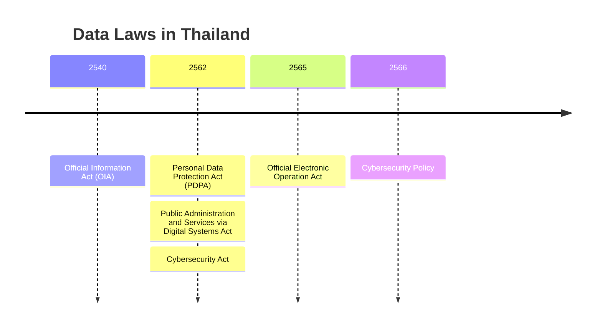
Repository นี้ พิจารณาเฉพาะด้านการรักษาความมั่นคงปลอดภัยไซเบอร์

# Cybersecurity
ดำเนินการตาม [ประมวลแนวทางปฏิบัติและกรอบมาตรฐานด้านการรักษาความมั่นคงปลอดภัยไซเบอร์](https://kietpawpan.github.io/pdpa/pdf/2564cyberGuide.PDF)
## 1. หน่วยงานโครงสร้างพื้นฐานสำคัญ
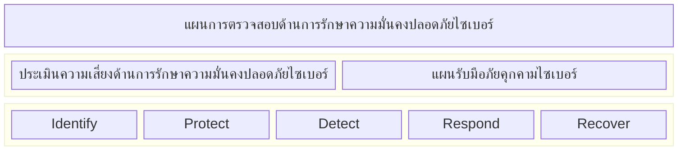
> [!Note]
> ต้องตรวจสอบอย่างน้อย ปีละ 1 ครั้ง
> ### 1.1 ผลกระทบทางธุรกิจ
> 1. ผู้ได้รับผลกระทบ คือ ประชาชนผู้ยื่นคำขอข้อมูลข่าวสารของ ทส.
> 2. ขั้นตอนที่กระทบ คือ การแสดงคู่มือประชาชน การยื่นคำขอ และการติดตามสถานะคำขอ
>
> ### 1.2 บริการที่สำคัญ
> ### 1.3 การปฏิบัติตามประมวลแนวทางปฏิบัติ
> ปฏิบัติตามประมวลแนวทางปฏิบัติและกรอบมาตรฐานด้านการรักษาความมั่นคงปลอดภัยไซเบอร์ พ.ศ. 2564
> ### 1.4 กำหนดนโยบายการบริหารความเสี่ยงด้านความมั่นคงปลอดภัยไซเบอร์

# [ภาพรวมงานคุ้มครองข้อมูลส่วนบุคคล](https://kietpawpan.github.io/pdpa/tasks.html)

## การประเมินความเสี่ยง
บริการที่สำคัญ
> ระบบ e-Request มีการเก็บรวบรวมข้อมูลส่วนบุคคล
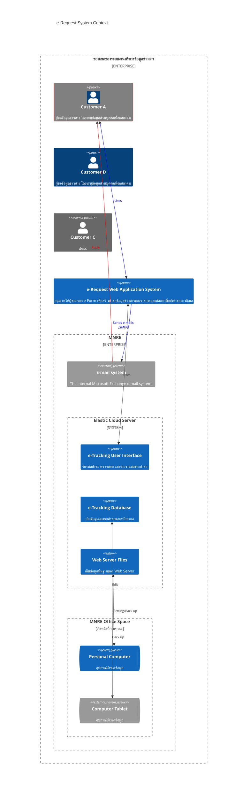
### ระบุความเสี่ยง
1. การเข้าถึงไฟล์ใน server ผ่าน Index Browing 
2. การ login เข้าเครื่อง sever โดยปราศจากอำนาจหรือโดยมิชอบ
3. การดักจับข้อมูลผ่าน http
4. ข้อมูลรั่วไหลจากสื่อบันทึกข้อมูลแบบถอดได้หรืออุปกรณ์แบบพกพา
5. ระบบ server ถูกโจมตี จนหยุดทำงาน         
   
### วิเคราะห์ความเสี่ยง
1. ติดตั้ง Server โดยไม่ได้ตั้งค่าปิด Index Browsing ทำให้ผู้ใช้มองเห็นไฟล์ในกรณีที่ Folder นั้น ไม่มีหน้า index
2. มีผู้แอบใช้ password ของ Admin ในการ login เข้าสู่ ESC
3. http://esc.mnre.go.th ไม่ปลอดภัย
4. การ backup ข้อมูลในสื่อบันทึกแบบถอดได้ หรืออุปกรณ์แบบพกพา อาจทำให้ข้อมูลรั่วไหล กรณีสุญหายหรือถูกโจรกรรม
5. ระบบ server ถูกโจมตีโดย jacker ทำให้ระบบใช้งานไม่ได้ เช่น ไวรัส การใส่ scripts การเปลี่ยนหน้า index และขโมยข้อมูล
   
### ประเมินค่าความเสี่ยง
1. ร้ายแรง
2. ร้ายแรง
3. ร้ายแรง
4. ร้ายแรง
5. ร้ายแรง

### Cybersecurity Measures 
การควบคุมความมั่นคงปลอดภัยไซเบอร์
1. ตั้งค่าเครื่องแม่ข่าย เพื่อห้ามฟังก์ชัน Index Browsing และปกปิดข้อมูลเกี่ยวกับ IP Addess รวมถึงชื่อโปรแกรมและรุ่นของ Web Server Software
2. ใช้รหัสผ่านเข้าเครื่องคอมพิวเตอร์แม่ข่าย ที่คาดเดายาก (strong password)
3. ติดตั้งใบรับรองความปลอดภัยอิเล็กทรอนนิกส์ (SSL Certificate) เพื่อเข้ารหัสการเชื่อมต่อเครื่องแม่ข่าย (https)
4. ไม่มีการเก็บข้อมูลในสื่อบันทึกข้อมูลแบบถอดได้หรืออุปกรณ์เคลื่อนที่ และตั้งรหัสสำหรับ PC ที่เก็บสำรองไฟล์
5. ติดตั้ง Firewall, Web Application Firewall, ระบบป้องกัน DDoS Attack, และโปรแกรม Antivirus, Update ซอฟแวร์ และ Operating System เป็นระยะ
6. สร้างความตระหนักรู้เรื่อง Cybersecurity
7. จัดทำแผนความต่อเนื่องทางธุรกิจ (Business Continuty Plan)
   
# งานคุ้มครองข้อมูลส่วนบุคคล   
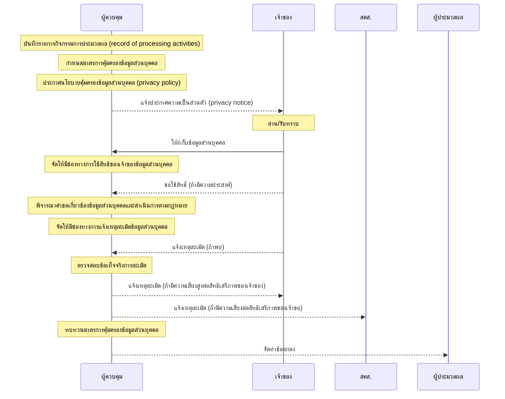
- [แนวทางการพิจารณาคำขอข้อมูลส่วนบุคคล](https://kietpawpan.github.io/pdpa/index.html)
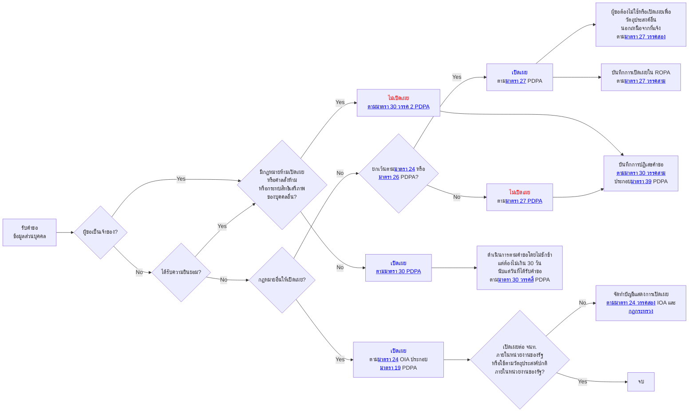
- [มาตรการคุ้มครองข้อมูลส่วนบุคคล](https://kietpawpan.github.io/pdpa/measures.html)
```mermaid
  stateDiagram-v2
	[*]-->มาตรการเชิงองค์กร
	state มาตรการเชิงองค์กร {
		[*]-->จัดฝึกอบรมเกี่ยวกับการคุ้มครองข้อมูลส่วนบุคคล
		จัดฝึกอบรมเกี่ยวกับการคุ้มครองข้อมูลส่วนบุคคล-->เวียนประกาศนโยบายคุ้มครองข้อมูลส่วนบุคคล
		เวียนประกาศนโยบายคุ้มครองข้อมูลส่วนบุคคล-->ปฏิบัติตามพระราชบัญญัติข้อมูลข่าวสารของราชการฯ
		ปฏิบัติตามพระราชบัญญัติข้อมูลข่าวสารของราชการฯ-->ปฏิบัติตามระเบียบว่าด้วยการรักษาความลับของทางราชการฯ
		ปฏิบัติตามระเบียบว่าด้วยการรักษาความลับของทางราชการฯ-->กำหนดผู้มีสิทธิเข้าถึงเครื่องแม่ข่ายเพียงคนเดียว
		กำหนดผู้มีสิทธิเข้าถึงเครื่องแม่ข่ายเพียงคนเดียว-->เก็บข้อมูลให้น้อยที่สุดและเท่าที่จำเป็น
		เก็บข้อมูลให้น้อยที่สุดและเท่าที่จำเป็น-->มีระบบทำลายเอกสารตามระเบียบว่าด้วยงานสารบรรณฯ
		มีระบบทำลายเอกสารตามระเบียบว่าด้วยงานสารบรรณฯ-->ซักซ้อมแนวปฏิบัติกรณีพบเหตุละเมิดข้อมูลส่วนบุคคล
		ซักซ้อมแนวปฏิบัติกรณีพบเหตุละเมิดข้อมูลส่วนบุคคล-->ใช้ระบบจีพีพีซีรองรับการปฏิบัติตามกฎหมายคุ้มครองข้อมูลส่วนบุคคล
		ใช้ระบบจีพีพีซีรองรับการปฏิบัติตามกฎหมายคุ้มครองข้อมูลส่วนบุคคล-->ตรวสอบบุคคลภายนอกที่เข้าออกอาคารอย่างเคร่งครัด
		ตรวสอบบุคคลภายนอกที่เข้าออกอาคารอย่างเคร่งครัด-->มาตรการเชิงกายภาพ
	state มาตรการเชิงกายภาพ {
		[*]--> ล๊อคห้องเก็บเครื่องแม่ข่าย
			ล๊อคห้องเก็บเครื่องแม่ข่าย-->ล๊อคตู้เก็บข้อมูลส่วนบุคคล
			ล๊อคตู้เก็บข้อมูลส่วนบุคคล-->ทำลายหรือลบข้อมูลเมื่อครบระยะเวลาเก็บรักษา
			ทำลายหรือลบข้อมูลเมื่อครบระยะเวลาเก็บรักษา-->เก็บรหัสเข้าระบบงานในที่ปลอดภัย
			เก็บรหัสเข้าระบบงานในที่ปลอดภัย-->ไม่เปิดคอมพิวเตอร์ทิ้งไว้
			ไม่เปิดคอมพิวเตอร์ทิ้งไว้-->ไม่ส่งต่ออีเมลที่มีข้อมูลส่วนบุคคล
			ไม่ส่งต่ออีเมลที่มีข้อมูลส่วนบุคคล-->ปกปิดข้อมูลส่วนบุคคลในเอกสารให้มากที่สุดเท่าที่สามารถกระทำได้
			ปกปิดข้อมูลส่วนบุคคลในเอกสารให้มากที่สุดเท่าที่สามารถกระทำได้-->มาตรการเชิงเทคนิค
	state มาตรการเชิงเทคนิค {
		[*]--> Firewall
			Firewall-->Web_Application_Firewall
			Web_Application_Firewall-->DDoS_Attack_Prevention
			DDoS_Attack_Prevention-->Antivirus
			Antivirus-->Secure_Server_Installation
			Secure_Server_Installation-->Best_Secure_Hash_Algorithm
			Best_Secure_Hash_Algorithm-->Regular_Softwares_Update
			Regular_Softwares_Update-->Comlicate_Password
			Comlicate_Password-->Secure_Socket_Layer
			Secure_Socket_Layer-->Form_Validation
			Form_Validation-->Htmlspecialcharacter
			Htmlspecialcharacter-->Enable_Logging
			Enable_Logging-->Regular_Password_Change
			Regular_Password_Change-->Server_Backup
			Server_Backup-->[*]}}}
```
[มาตการหลัก 5 ประการ](https://kietpawpan.github.io/pdpa/5measures.html)
# การประเมินความเสี่ยง
เพื่อควบคุมให้มีความเสี่ยงต่ำหรือไม่มีนัยสำคัญ
1. ถ้ามีผลกระทบต่อสิทธิเสรีภาพสูง ต้องทำให้ข้อมูลให้ระบุตัวตนไม่ได้ เช่น เข้ารหัส หรือปกปิดบางส่วน
2. ถ้าข้อมูลจำเป็นต้องระบุตัวตนได้ ต้องทำให้มีผลกระทบต่ำ เช่น ปกปิดบางส่วน ป้องกันการเข้าถึง
3. ถ้าข้อมูลถูกละเมิดแล้ว ระบบทำงานผิดปกติ ต้องสำรองข้อมูล และมีระบบตรวจจับการละเมิด
   
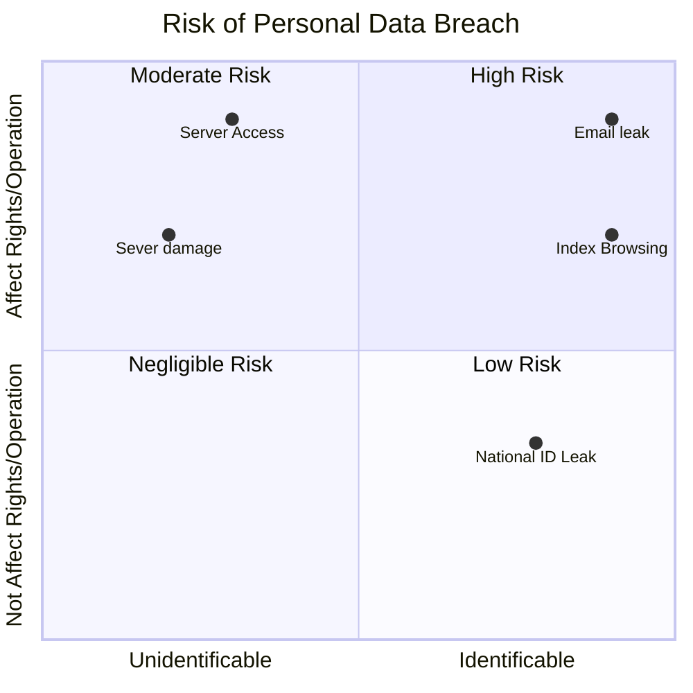
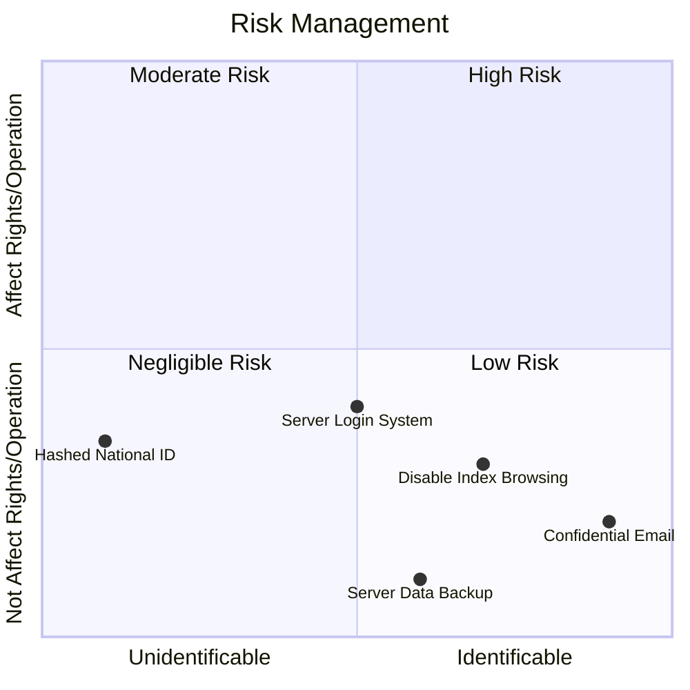
# Information Assets
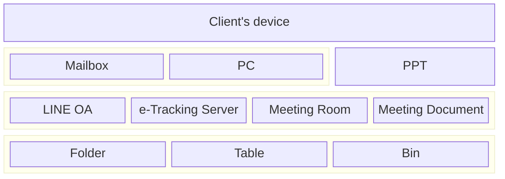
# Risk Identification
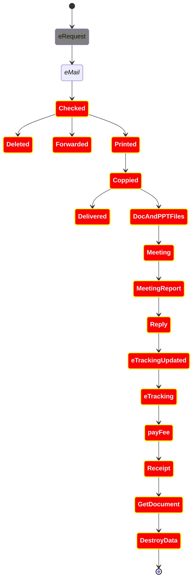
# Key Risks with Email
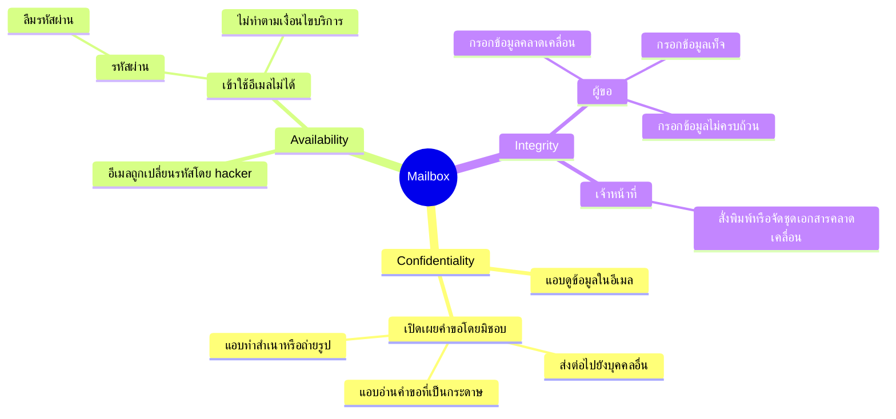
>[!TIP]
> มาตรการเชิงองค์กร
> - จัดทำแนวปฏิบัติ แจ้งเวียนเพื่อทราบและถือปฏิบัติโดยเคร่งครัด
> - ห้ามส่งต่ออีเมลไปยังบุคคลอื่น
> - สั่งพิมพ์เป็นเอกสาร แล้วกำหนดเป็นข้อมูลข่าวสารลับ
> - กำชับเจ้าหน้าที่ให้ปฏิบัติตามระบียบว่าด้วยการรักษาความลับของทางราชการ พ.ศ. 2540 และที่แก้ไขเพิ่มเติมอย่างเคร่งครัด
> 
> มาตรการเชิงเทคนิค
> - ตั้งรหัสผ่านที่คาดเดายาก (strong password) และเปลี่ยนทุก 90 วัน
> - ปฏิบัติตามเงื่อนไขของผู้ให้บริการอีเมล
> - เก็บรหัสผ่านไว้ในที่ปลอดภัย
> - ไม่เปิดคอมพิวเตอร์ทิ้งไว้ และต้องใช้รหัสผ่านในการเปิดเครื่อง
> - แจ้งเตือนผ่าน App e-Request ให้ผู้ขอกรอกข้อมูลให้ครบถ้วนถูกต้อง

# การละเมิด
ดำเนินการตาม [คู่มือการปฏิบัติตามหลักเกณฑ์และวิธีการแจ้งเหตุการละเมิดข้อมูลส่วนบุคคล พ.ศ. 2565](https://kietpawpan.github.io/pdpa/lamerd.html)
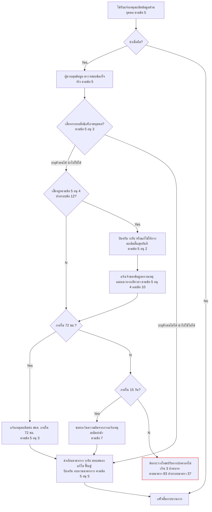

# ร่างแผน
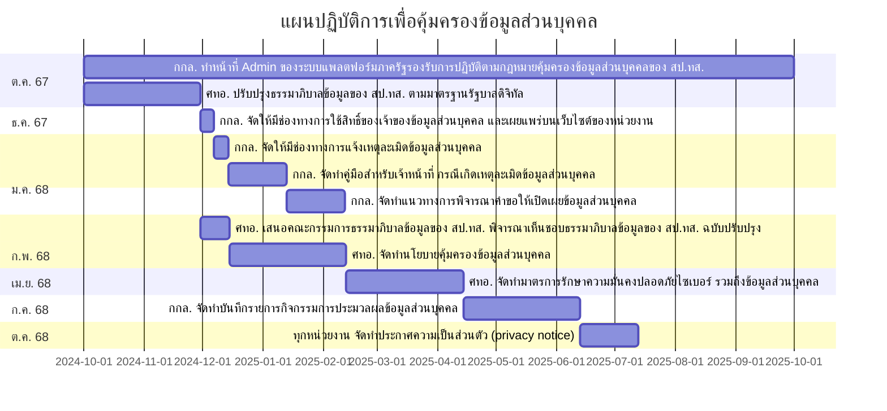
