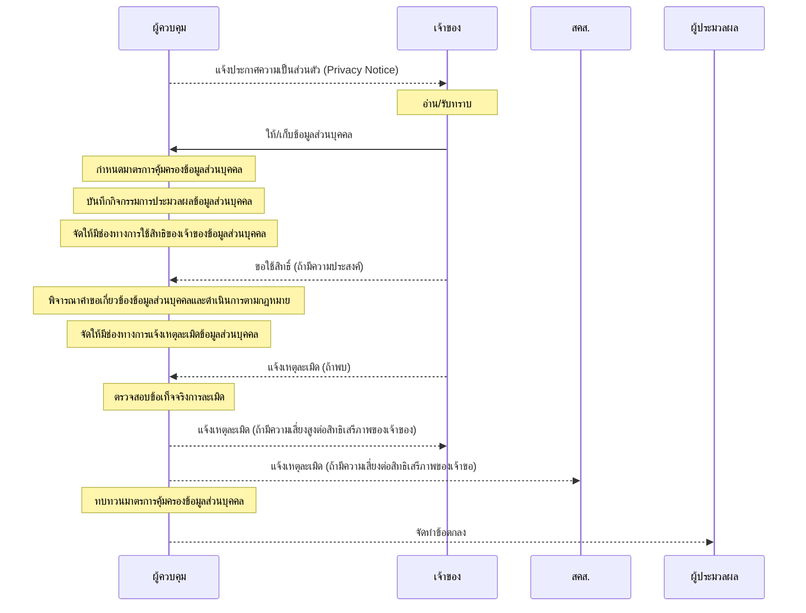

# pdpa

- [ภาพรวมงานคุ้มครองข้อมูลส่วนบุคคล](https://kietpawpan.github.io/pdpa/tasks.html)


- [แนวทางการพิจารณาคำขอข้อมูลส่วนบุคคล](https://kietpawpan.github.io/pdpa/)
- [มาตรการคุ้มครองข้อมูลส่วนบุคคล](https://kietpawpan.github.io/pdpa/measures.html)
  ```mermaid
  stateDiagram-v2
	[*]-->มาตรการเชิงองค์กร
	state มาตรการเชิงองค์กร {
		[*]-->จัดฝึกอบรมเกี่ยวกับการคุ้มครองข้อมูลส่วนบุคคล
		จัดฝึกอบรมเกี่ยวกับการคุ้มครองข้อมูลส่วนบุคคล-->เวียนประกาศนโยบายคุ้มครองข้อมูลส่วนบุคคล
		เวียนประกาศนโยบายคุ้มครองข้อมูลส่วนบุคคล-->ปฏิบัติตามพระราชบัญญัติข้อมูลข่าวสารของราชการฯ
		ปฏิบัติตามพระราชบัญญัติข้อมูลข่าวสารของราชการฯ-->ปฏิบัติตามระเบียบว่าด้วยการรักษาความลับของทางราชการฯ
		ปฏิบัติตามระเบียบว่าด้วยการรักษาความลับของทางราชการฯ-->กำหนดผู้มีสิทธิเข้าถึงเครื่องแม่ข่ายเพียงคนเดียว
		กำหนดผู้มีสิทธิเข้าถึงเครื่องแม่ข่ายเพียงคนเดียว-->เก็บข้อมูลให้น้อยที่สุดและเท่าที่จำเป็น
		เก็บข้อมูลให้น้อยที่สุดและเท่าที่จำเป็น-->มีระบบทำลายเอกสารตามระเบียบว่าด้วยงานสารบรรณฯ
		มีระบบทำลายเอกสารตามระเบียบว่าด้วยงานสารบรรณฯ-->ซักซ้อมแนวปฏิบัติกรณีพบเหตุละเมิดข้อมูลส่วนบุคคล
		ซักซ้อมแนวปฏิบัติกรณีพบเหตุละเมิดข้อมูลส่วนบุคคล-->ใช้ระบบจีพีพีซีรองรับการปฏิบัติตามกฎหมายคุ้มครองข้อมูลส่วนบุคคล
		ใช้ระบบจีพีพีซีรองรับการปฏิบัติตามกฎหมายคุ้มครองข้อมูลส่วนบุคคล-->ตรวสอบบุคคลภายนอกที่เข้าออกอาคารอย่างเคร่งครัด
		ตรวสอบบุคคลภายนอกที่เข้าออกอาคารอย่างเคร่งครัด-->มาตรการเชิงกายภาพ
	state มาตรการเชิงกายภาพ {
		[*]--> ล๊อคห้องเก็บเครื่องแม่ข่าย
			ล๊อคห้องเก็บเครื่องแม่ข่าย-->ล๊อคตู้เก็บข้อมูลส่วนบุคคล
			ล๊อคตู้เก็บข้อมูลส่วนบุคคล-->ทำลายหรือลบข้อมูลเมื่อครบระยะเวลาเก็บรักษา
			ทำลายหรือลบข้อมูลเมื่อครบระยะเวลาเก็บรักษา-->เก็บรหัสเข้าระบบงานในที่ปลอดภัย
			เก็บรหัสเข้าระบบงานในที่ปลอดภัย-->ไม่เปิดคอมพิวเตอร์ทิ้งไว้
			ไม่เปิดคอมพิวเตอร์ทิ้งไว้-->ไม่ส่งต่ออีเมลที่มีข้อมูลส่วนบุคคล
			ไม่ส่งต่ออีเมลที่มีข้อมูลส่วนบุคคล-->ปกปิดข้อมูลส่วนบุคคลในเอกสารให้มากที่สุดเท่าที่สามารถกระทำได้
			ปกปิดข้อมูลส่วนบุคคลในเอกสารให้มากที่สุดเท่าที่สามารถกระทำได้-->มาตรการเชิงเทคนิค
	state มาตรการเชิงเทคนิค {
		[*]--> Firewall
			Firewall-->Web_Application_Firewall
			Web_Application_Firewall-->DDoS_Attack_Prevention
			DDoS_Attack_Prevention-->Antivirus
			Antivirus-->Secure_Server_Installation
			Secure_Server_Installation-->Best_Secure_Hash_Algorithm
			Best_Secure_Hash_Algorithm-->Regular_Softwares_Update
			Regular_Softwares_Update-->Comlicate_Password
			Comlicate_Password-->Secure_Socket_Layer
			Secure_Socket_Layer-->Form_Validation
			Form_Validation-->Htmlspecialcharacter
			Htmlspecialcharacter-->Enable_Logging
			Enable_Logging-->Regular_Password_Change
			Regular_Password_Change-->[*]
}}}

  ```
