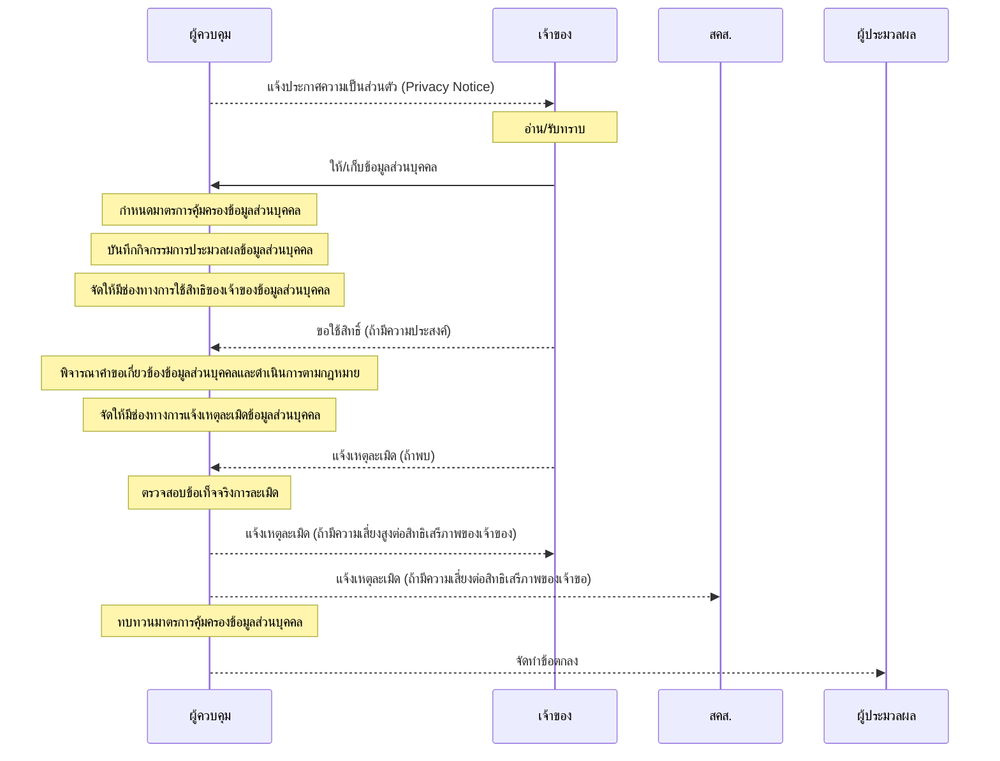

# pdpa

- [ภาพรวมงานคุ้มครองข้อมูลส่วนบุคคล](https://kietpawpan.github.io/pdpa/tasks.html)


- [แนวทางการพิจารณาคำขอข้อมูลส่วนบุคคล](https://kietpawpan.github.io/pdpa/)
  ```mermaid
  flowchart LR
    A[รับคำขอ<br>ข้อมูลส่วนบุคคล] --> B{ผู้ขอเป็นเจ้าของ?}
    B -->|Yes| C{มีกฎหมายห้ามเปิดเผย<br>หรือศาลสั่งห้าม<br>หรือกระทบสิทธิเสรีภาพ<br>ของบุคคลอื่น?}
         B -->|No| E{ได้รับความยินยอม?}
         C --> |Yes| D[<font color="red">ไม่เปิดเผย </font><br><a href="#30v2">ตามมาตรา 30 วรรค 2 PDPA</a>]-->N[บันทึกการปฏิเสธคำขอ<br><a href="#30v3">ตามมาตรา 30 วรรคสาม</a><br>ประกอบ<a href="#39">มาตรา 39</a> PDPA]
    C-->|No| G[<font color="blue">เปิดเผย</font> <br><a href="#30">ตามมาตรา 30 PDPA</a>]
E-->|Yes| C
E-->|No| F{กฎหมายอื่นให้เปิดเผย?}
F-->|Yes| H[<font color="blue">เปิดเผย</font><br>ตาม<a href="#24ioa">มาตรา 24</a> OIA ประกอบ<a href="#19">มาตรา 19</a> PDPA]
F-->|No| I{ยกเว้นตาม<a href="#24">มาตรา 24</a> หรือ<br><a href="#26">มาตรา 26</a> PDPA?}
I-->|Yes| K[<font color="blue">เปิดเผย</font><br>ตาม<a href="#27">มาตรา 27</a> PDPA]
I-->|No| J[<font color="red">ไม่เปิดเผย</font><br>ตาม<a href="#27">มาตรา 27 PDPA</a>]-->N
K-->L[บันทึกการเปิดเผยใน ROPA<br>ตาม<a href="#27v3">มาตรา 27 วรรคสาม</a>]
K-->M[ผู้ขอต้องไม่ใช้หรือเปิดเผยเพื่อวัตถุประสงค์อื่น<br>นอกเหนือจากที่แจ้ง<br>ตาม<a href="#27v2">มาตรา 27 วรรคสอง</a>]
H-->P{เปิดเผยต่อ จนท.<br>ภายในหน่วยงานของรัฐ<br>หรือใช้ตามวัตถุประสงค์ปกติ<br>ภายในหน่วยงานของรัฐ?}
P-->|Yes| O[จบ]
P-->|No| Q[จัดทำบัญชีแสดงการเปิดเผย<br><a href="#24v2ioa">ตามมาตรา 24 วรรคสอง</a> IOA และ<br><a href="pdf/reg24v2ioa.pdf">กฎกระทรวง</a>]
G-->R[ดำเนินการตามคำขอโดยไม่ชักช้า<br>แต่ต้องไม่เกิน 30 วัน<br>นับแต่วันที่ได้รับคำขอ<br>ตาม<a href="#30v4">มาตรา 30 วรรคสี่</a> PDPA]
```
- [มาตรการคุ้มครองข้อมูลส่วนบุคคล](https://kietpawpan.github.io/pdpa/measures.html)
